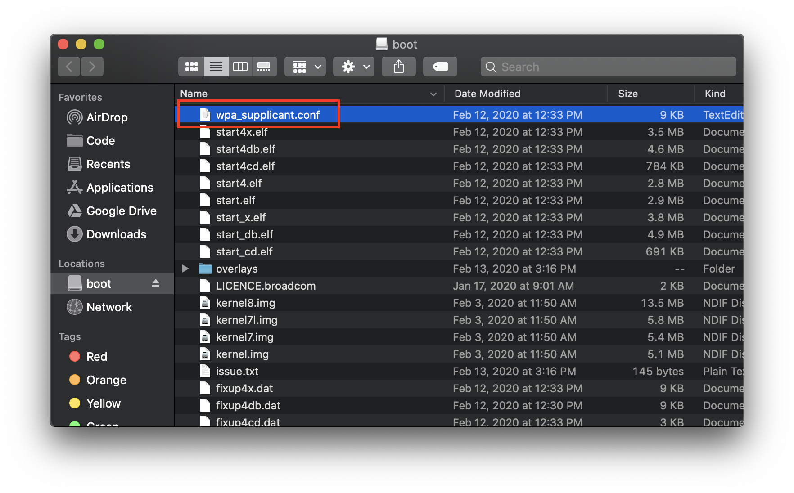
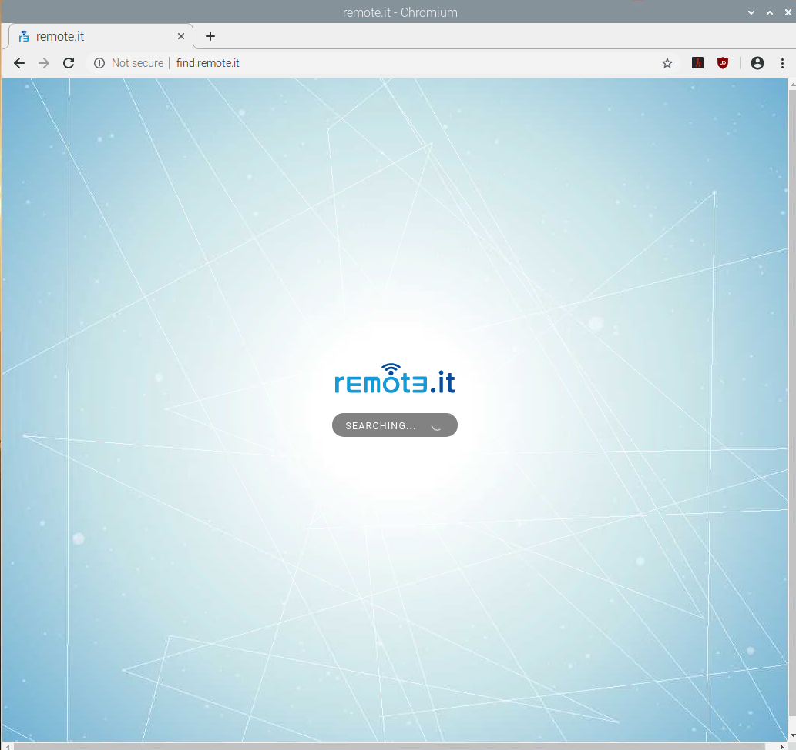
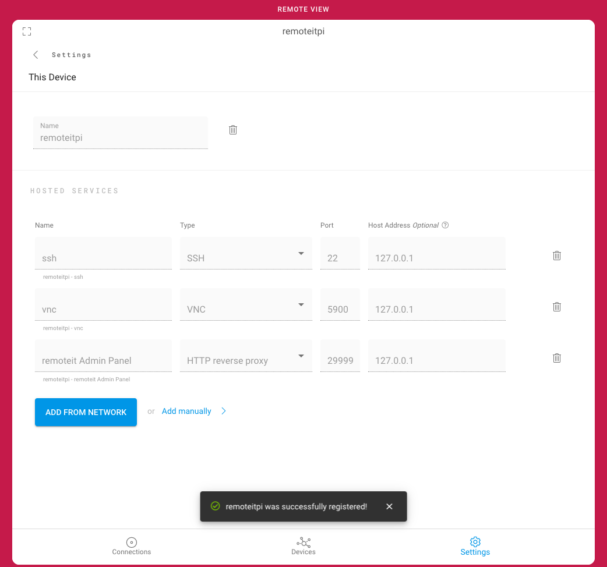
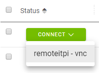

# Raspberry Pi Quick Start \(remote.itPi SD Card image\)

## Overview

For a quick and easy connection to a new Raspberry Pi, use our Raspbian OS image with remote.it already installed. This is useful for applications in a business or office where you need to set up remote access to the network quickly.

remote.itPi is an SD card operating system image for Raspberry Pi based on the latest Raspbian Buster OS. For more information about the specific OS used, click [**here.**](https://www.raspberrypi.org/downloads/raspbian/) ****The remote.itPi SD card image is identical to Raspbian with the addition of the remote.it application. The remote.itPi image includes the free remote.it application to enable instant remote access using SSH or VNC to any private network where the Pi is connected. 

Once connected to the network, the Pi will provide direct remote access for authenticated users to any computers, routers, NAS storage boxes, printers, etc. connected to the same remote network.

Follow the simple steps below to activate remote access to your Pi!

## What you'll need

* remote.itPi Image .zip: [**Download here**](https://downloads.remote.it/remote.itPi/latest/remote.itPi.img.zip)\*\*\*\*
* Formatted micro SD card
* micro SD card reader
* [Raspberry Pi Imager](https://www.raspberrypi.org/downloads/) \(To write the remote.itPi Image onto the micro SD\)


If you encounter any issues using the Raspberry Pi Imager, try the [Balena Etcher](https://www.balena.io/etcher/) application instead.


## Important Information

* **The remoteitPi OS default user is “pi“, password is “raspberry“.**
* **For security purposes, the root password is not set by default. If you would like to set the root password, run the command `sudo passwd root`.**
* No HDMI display, mouse, or keyboard is needed for the Pi \(Headless Setup\).
* SSH \(port 22\) and VNC \(port 5900/tcp\) are both enabled by default in this image to allow you to bring up the Pi in a Headless configuration from any other computer on the same network.
* The rootfs partition is automatically expanded to maximize the available space on the SD card.
* When installing on multiple devices, the Pi's hostname will be incremented automatically \(e.g. remoteitpi-2, remoteitpi-3, etc.\).
* remote.itPi is supported only on Raspberry Pi 2, Pi 3, Pi 4, and Pi Zero W.


**Security Warning: Make sure to change the Pi password using the `sudo raspi-config` utility after boot up as described in the detailed step-by-step instructions.**


## **Tutorial**

Follow the simple steps below to activate remote access to the Pi, and from there, the Pi will provide direct access to any other device, computer, router, printer, NAS storage box, etc. on the same network.

### Install the remoteitPi image

1. Download remote.itPi.img.zip to your computer if you haven't already, found [**here.**](https://downloads.remote.it/pi/latest/remote.itPi.img.zip) ****
2. Extract the contents of the zip file onto your computer. 
3. Insert the formatted micro SD into your micro SD card reader, then connect the card reader to your computer. \(If you haven't formatted your micro SD, you can use Raspberry Pi Imager to do so.\) If you haven't already downloaded the Raspberry Pi Imager, you can find it [**here.**](https://www.raspberrypi.org/downloads/) ****
4. Launch Raspberry Pi Imager. 

*  Under "Operating System," click **CHOOSE OS**. When prompted, select the &lt;**Use custom** option. Locate and select the **remote.itPi.img** that you extracted from the .zip file.
*  Under "SD Card," click **CHOOSE SD CARD**. When prompted, select your formatted micro SD's drive.
*  Click **WRITE** to begin writing the remote.itPi image onto the micro SD. This process will take a few minutes.


**Note:** If you haven't formatted your micro SD, you can use Raspberry Pi Imager to do so.




If you encounter any issues using the Raspberry Pi Imager, try the [Balena Etcher](https://www.balena.io/etcher/) application instead.


### **Optional: Wi-Fi accessibility**

If you are connecting to your remote.itPi device to the internet via Ethernet, you can skip this step. 

1. Navigate to the micro SD's **/boot** directory and open **wpa\_supplicant.conf** in a text editor. If you don't see the **/boot** directory, you may need to remove the micro SD card from the slot, then re-insert it. 
2. On the line that says `ssid="YOUR SSID"`, replace `YOUR SSID` with the name of your Wi-Fi network. \(Example: `ssid="MyWiFi123"`\) 
3. On the line that says `psk="YOUR PASSPHRASE"`, replace `YOUR PASSPHRASE` with the password for your Wi-Fi network. \(Example: `psk="P@ssword"`\) 
4. On the line that says `country=US`, replace `US` with your country code. A list of Wi-Fi country codes can be found [**here.**](https://github.com/recalbox/recalbox-os/wiki/Wifi-country-code-%28EN%29) 
5. Save the file. 
6. Locate the **/boot** directory on your computer's file directory. 
7. Right-click the **/boot** directory to access the menu. 
8. Click **Eject** to eject the micro SD card reader from your computer.

```text
country=US  
ctrl_interface=DIR=/var/run/wpa_supplicant GROUP=netdev  
update_config=1  

network={
    ssid="remote.itPi"
    psk="remote.itPi"
}

network={
    ssid="YOUR SSID"
    psk="YOUR PASSPHRASE"
}
```



### Power on your Pi

1. Remove the micro SD from the card reader and insert it into the remote.itPi. If you are connecting the remote.itPi to the internet via Ethernet, plug the Ethernet cable into the remote.itPi. The other end of the Ethernet cable should connect to an available "LAN" port on your router. 
2.  Connect a USB power cable to the remote.itPi to power on the Raspberry Pi.  Wait a minute or two for it to complete the boot process.

### Find your Pi on the LAN

1.  From your computer, open your browser and navigate to: [http://find.remote.it](http://find.remote.it/).  You may get a "Not secure" message from your browser, e.g.


    2. The browser will search for your remote.itPi device on the LAN. If your device isn't detected after the initial search, wait a minute, then click **Search again**.


**Note:** Make sure you disable any pop-up blocker extensions or software for the domain "x.remote.it" or this web page may not load properly.





**Note:** If your device isn't detected after a few search attempts, make sure your Wi-Fi credentials are correct in the **wpa\_supplicant.conf** file \(if the device is connected Wi-Fi\) or that the Ethernet is connected properly. Additionally, please make sure that the device you are accessing find.remote.it from is on the same network as the Pi you are trying to locate.


### Connect

 After scanning completes, you will see something like "1 of 1" or "1 of 2" above the displayed remote.itPi details. That represents "\(current device\) of \(total devices\)" which were found on your LAN.  You can quickly access the remote.it Admin Panel of any devices you've previously configured using remoteit.

The first one may or may not be the Raspberry Pi you're trying to configure. Use the forward \( &gt; \) and back \( &lt; \) arrows to locate your new device if more than one is found. Once you find your new remote.itPi, click **CONNECT** to connect to it.


You will be prompted to log in to your remote.it account. If you have not created a remote.it account, click "Create an account" to create one.


 Once you log in, you will be prompted to register your remote.itPi by providing a name for it. Enter a name, then click **REGISTER**.


The Device will be registered with the 3 default Services as shown.  

We recommend that you not delete SSH or the remote.it Admin Panel though, as this could prevent you from access your Pi remotely.  You can add other Services later if you wish, or delete any of the default Services you are not using.  

### Adding additional Services on the local Device or networked devices.

To add additional Services after the initial setup, come back to [http://find.remote.it](http://find.remote.it) if on the same LAN as your Device, or access the remote.it Admin Panel remotely using remote.it!



Congratulations! Your remote.itPi is now registered to your remote.it account! You can now connect to your remote.itPi from any device with remote.it installed, or from a browser at using the  web portal.

### Using the remote.it Web Portal

 You can also use the [**remote.it web portal**](https://app.remote.it/) to connect to your remote.itPi device. You can view your configured Devices on the web portal's "Devices" page.

Find your remote.itPi device and click _CONNECT_ under "Status".


You will be shown a drop-down menu that shows all the available services on your remote.itPi device. Click on a service name to start a connection.



When a connection is established, you will see information on how to access the service. Here is an example of the information for accessing the device's graphical desktop using VNC:


Open your VNC client application and enter the provided URL:port to connect to your remote.itPi.


You will be prompted to enter a username and password. The default login information for remote.itPi is:

* Username: pi
* Password: raspberry


### Optional: Additional Tools

#### Additional Services

remoteitPi uses a Desktop application for the Raspberry Pi. There are multiple ways to access the Desktop app. You can use your web browser and type localhost:29999 in the search bar, you can click on the shortcut on the desktop, or you can navigate to the _Chromium Apps_ tab in the Pi menu and launch the remote.it Desktop Application from there. You can use the Desktop App for things like adding additional Services to your Device and connecting to other Services.

To learn more about the Desktop App, please see this guide:



#### Additional Applications

To download and install applications on your Pi, you must have access to the root password, which is different than the user password. On the remote.itPi image, the root password is not set by default. If you want to set the password for root, you can run the command `sudo passwd root` with user pi.

