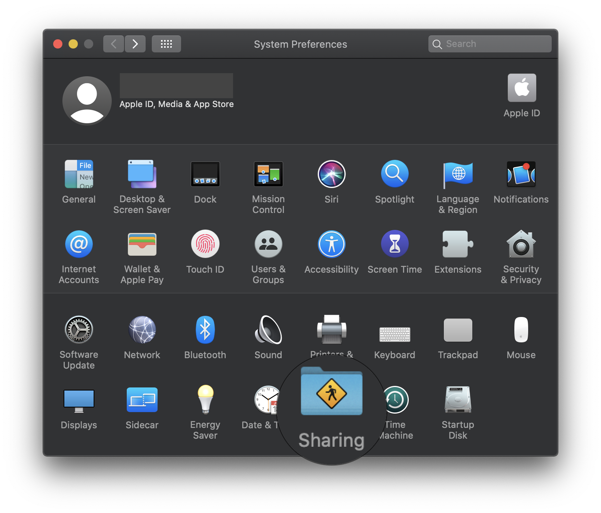
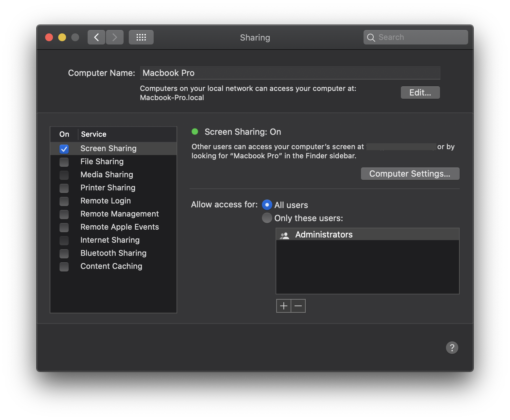
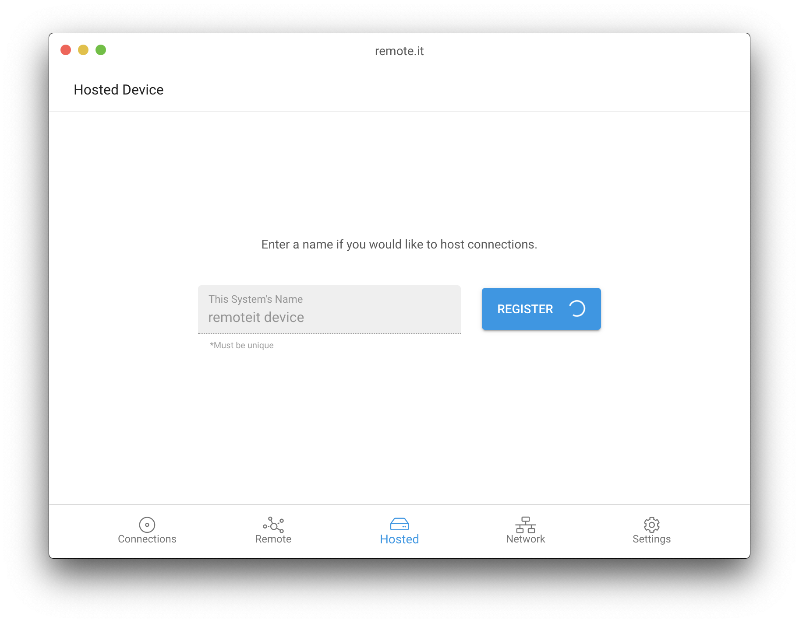
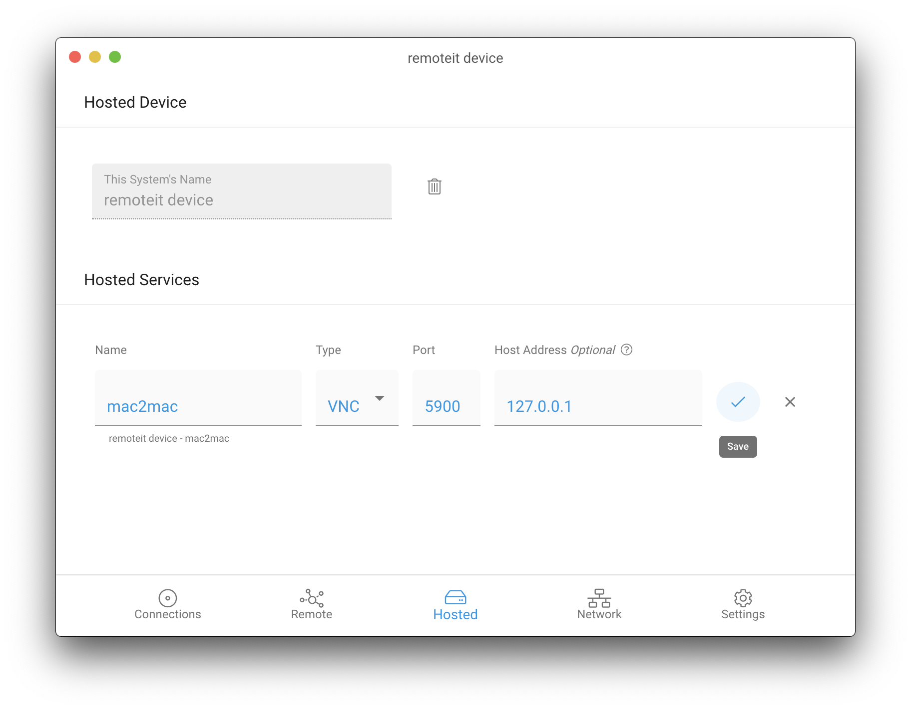
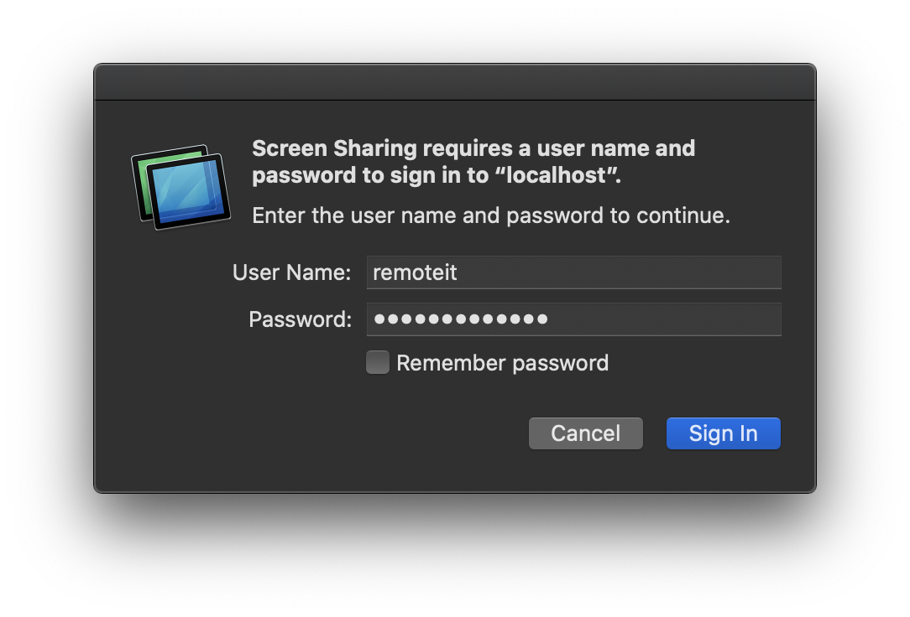

# Control your MacOS Device Remotely \(MacOS to MacOS\)

## Overview

Usually, Screen Sharing remotely between two MacOS devices requires the insecure opening of ports on your internet connection. With remote.it, however, it's possible to remotely control and share screens between two MacOS devices quickly, securely, and without opening ports.


A new video tutorial on this topic has been released! Check it out [**here!**](https://youtu.be/OrljJIk33LA)\*\*\*\*


remote.it, along with the built-in Screen Sharing app on MacOS, is all you need for this to work. Please follow the simple steps below to configure remote access:

**The steps to setup are:**

1. Enable Screen Sharing.
2. Create a remote.it Service.
3. Connect Remotely.

## Enable Screen Sharing

The first step to remotely accessing your MacOS device is to enable Screen Sharing on that device. To do this, open your _System Preferences_ and click _Sharing_.

Next, select the Screen Sharing checkbox, and select "All users."

Now you are ready to set up a connection with remote.it!

## Create a Service

First, download and launch the remote.it Desktop App, found [**here.**](https://github.com/remoteit/desktop/releases/latest)

Once you've created an account and signed in, register your Device on the _Hosted_ tab.

Next, click "Add" and select VNC from the drop-down menu titled _Type._ Click the check-mark to add the VNC Service to your device.

Now, that the Service is created, you're ready to connect remotely!

## Connect Remotely

Now, download the Desktop App on the MacOS device you want to control from. Log in with the same credentials that you used when setting up the Service on the other Device. After a few minutes the Device will appear under the _Remote_ tab. 

Click it, then click "Connect." Once you've connected, you will see a monitor icon.

Click the icon to launch the Screen Sharing application. Enter in the username and password of the MacOS device you are connecting too, then click "Sign In".

You are now remotely connected to your MacOS device!

## More Information

### Optional: Share the Connection

If you want another user to be able to connect to your MacOS device, you will need to share the Device. For more information on sharing Devices, please see this guide:



### Desktop App Information

For more information on how to use the Desktop App, see this guide:



