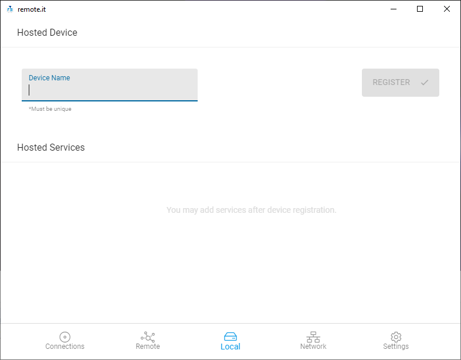
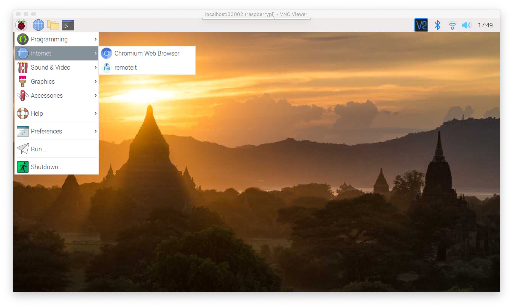
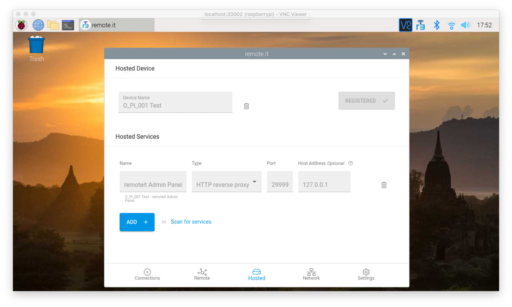
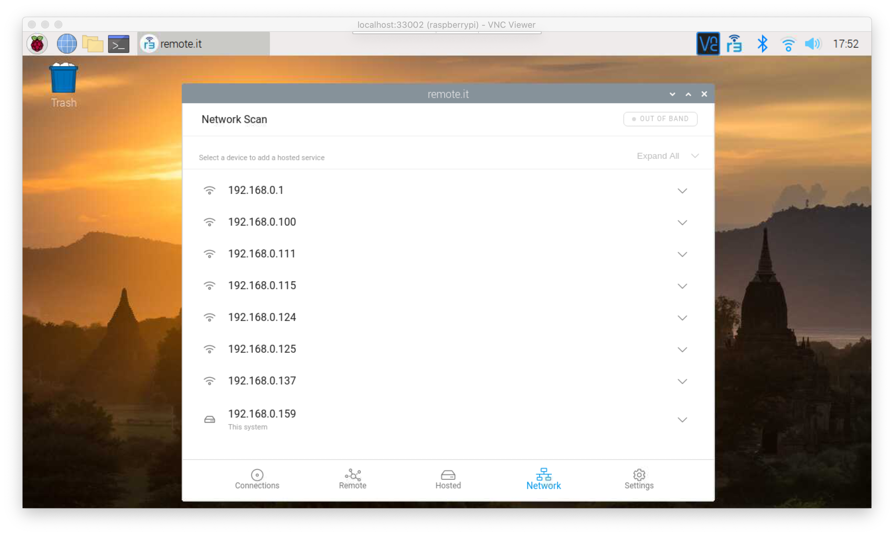
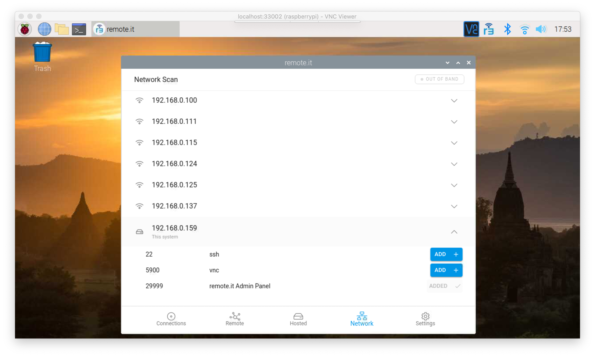
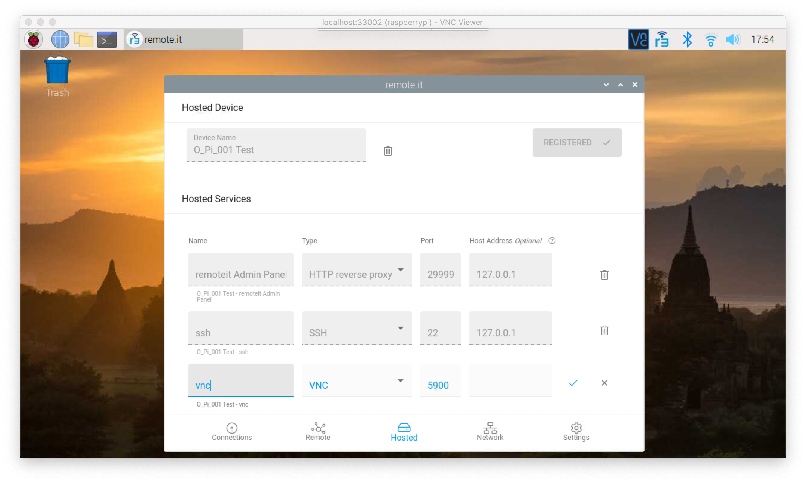
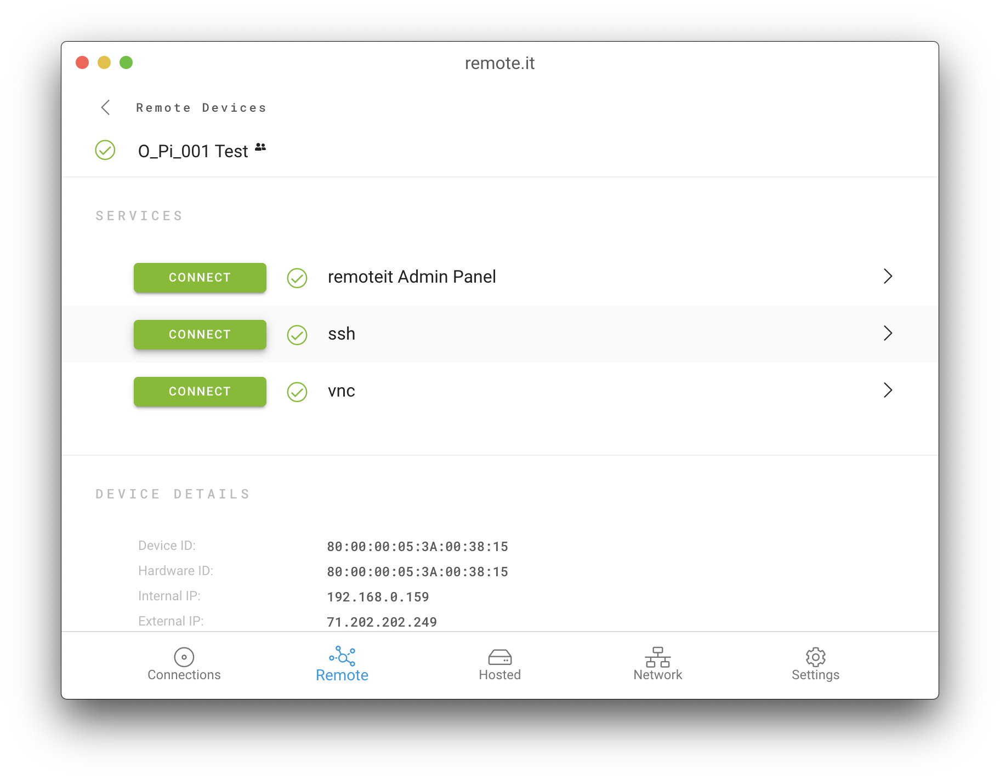
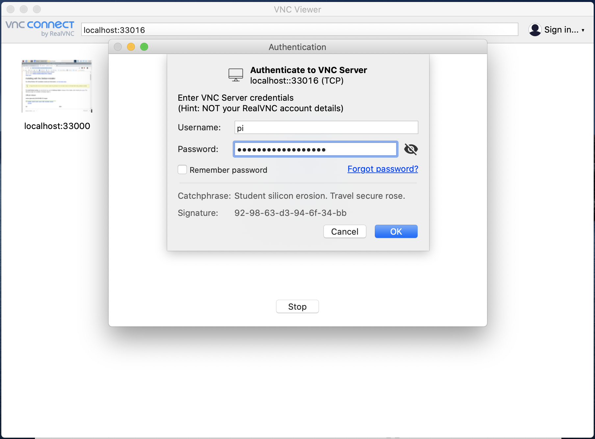

# Connecting to a Raspberry Pi with VNC or SSH

## Overview

In this guide you will learn how to configure a Raspberry Pi to allow it to be controlled from another machine using VNC or SSH through remote.it, using the desktop app. Following this tutorial will leave you with a secure connection between two machines that is quick and easy to access from anywhere, as well as shareable and flexible.

Enabling your Pi to be remotely accessed is a relatively simple process. The steps are as follows:

1. Enable SSH and/or VNC on your Pi.
2. Download and install remote.it.
3. Add the SSH and/or VNC service to your Device.
4. Install remote.it on the Device you want to access the Pi from, and connect.

## Enable SSH/VNC on your Pi

First, you'll have to enable the ability to SSH and/or VNC into your Pi. 

Access your Pi, then click the menu in the upper left corner and select _Preferences_ from the menu. 

Next, click _Raspberry Pi Configuration_ and navigate to the _Interfaces_ tab. Make sure that either VNC or SSH \(or both\) are enabled. 

Now, let's set up remote.it! 


**NOTE:** If you would rather use the terminal to activate these options, you can run`sudo raspi-config` __and select option 5. You can then enable SSH and VNC from there.


## Install remote.it on your Pi

To VNC or SSH into a Raspberry Pi using remote.it, you'll have to create a remote.it account. Make one ****[**here**](https://app.remote.it/auth/#/sign-up).

Download and install the desktop app, found [**here**](https://github.com/remoteit/desktop/releases/latest). Once it's installed, you can find it on your Pi using the menu in the top left, and navigating to the _Internet_ tab.

## Add the desired services

The next step is to add the SSH and/or VNC services to your device, so that you can access your Device using remote.it.

Click on the remote.it desktop app and log in using your credentials. Click the _Hosted_ tab at the bottom and register your device.

Next, navigate to the _Network_ tab or click _Scan for services_. Scan the network that the Pi is on and find your system, labeled “This system.” 

Click it, and you will see the Services that you can add to the Device. 

Click Add next to vnc, ssh, or whatever other Service you would like to add. It will take you back to the _Hosted_ tab to finish setting it up. 

Name the Service, then click the blue checkmark.


**NOTE:** If the Host IP Address is blank, don’t worry about it. The app will fill it in for you once you press the check mark.


## Install remote.it on the controller

Now that you've installed the Service\(s\), you can SSH or VNC into your Pi from any other machine. 

Log into the remote.it desktop app on the machine you wish to access the Pi from. The Device will appear under the _Remote_ tab. Click it, then connect to the desired service. 


Downloading something like [**PuTTY**](https://www.chiark.greenend.org.uk/~sgtatham/putty/) \(Windows only\) for SSH or [**VNC Viewer**](https://www.realvnc.com/en/connect/download/viewer/) for VNC may be very helpful in connecting to your Raspberry Pi.


Click on the Service you are now connected to. Copy the information into the appropriate program, and connect. 

Voila! You are now connected to the Pi via SSH/VNC using remote.it! Paste the VNC string into your VNC client of choice and you will be able to control your Pi.

## Advanced Applications

If you are looking for more advanced applications of Remote Graphical Desktop Access, please refer to the following guides.







