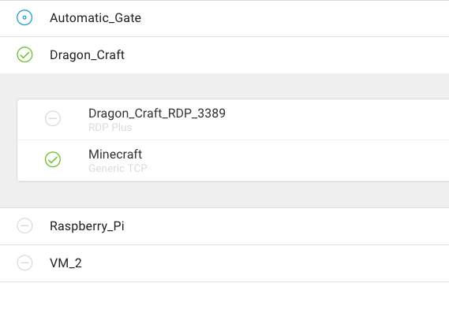
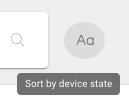
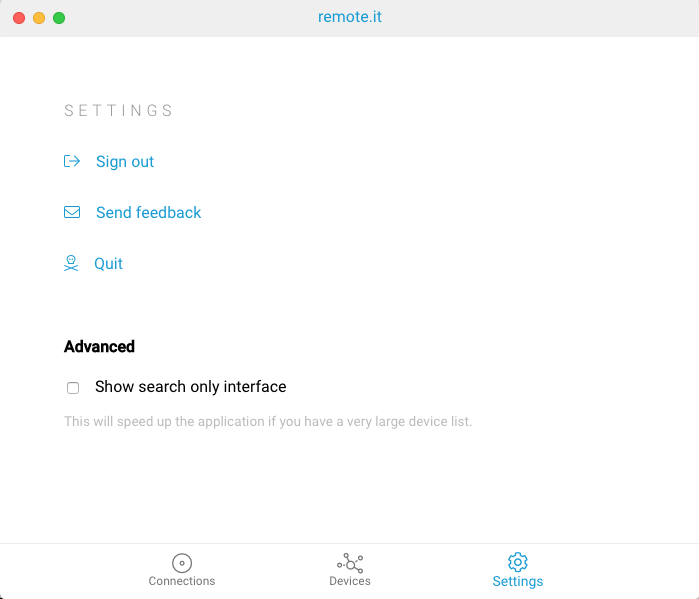

# Using the Desktop App \(Beta\)

## **New Desktop App for macOS/Windows**

This is documentation for the new, _in-beta_ remote.it desktop app. For a video tutorial, check out:



### **Why Use the Desktop Application?**

The desktop app gives you:

* Consistent IP address and port numbers, which you can save;
* Persistent connections;
* Faster, peer-to-peer connections;
* A more permanent link to your target device that can be "bookmarked";
* A more lightweight interface than the portal.

## **Installation**

Download the installer for macOS here: [Link](https://github.com/remoteit/desktop/releases/download/v1.7.0/remote.it-1.7.0.dmg).

Download the installer for Windows here: [Link](https://github.com/remoteit/desktop/releases/download/v1.9.4/remote.it-1.9.4.exe).

Unzip the file, then install and open the "remote.it" application.

## **How to Use the Desktop App**

### **Launch App**

You can find and click the remote.it icon on the task bar.

### **Logging In**

Enter in your remote.it credentials \(your email and password\) and press sign in.

This should take you to a screen with a list of your devices.

### Navigation

There are three tabs: the Connections tab, the Devices tab, and the Settings tab. The Devices tab is probably where you spend most of your time. Click on a tab to go to that tab.

### **The Devices Tab – Making a Connection**

The Devices tab \(middle tab on the bottom\) has a list of your devices. You can click on any device to show/hide its services. The name and description of each service is shown.

A grayed-out circle with a dash indicates that service/device is offline. A green checkbox and circle indicates that the service/device is online. A blue circle indicates that the service/device currently has an active connection.

You can click on any online service to connect to it. This will provide you with a localhost address which you can use in your application.

The PID \(process ID\) of the _connectd_ process handling the connection is given under the service name. You can copy the localhost address with the gray copy button, restart the connection with the blue button, and stop the connection with the red button. After you stop a connection, the service online/offline indicator will turn orange.


**Note:** it won't "forget" the service or device, just the connection.


The blue button will remake the connection on the _same_ localhost port, and the red button will "forget" the connection, returning things back to normal. Thus, forgetting the connection may invalidate some of your old links or bookmarks to that device.

If you don't have any devices, an orange banner will appear.

If you have too many devices, you will have to search for your device.

For organization, you can either sort your device list by name or by status. This button is in the top right. You can refresh your list of devices \(in case it has updated since you opened the app\) by pressing the adjacent refresh button.

#### Searching for a Device/Service

When in the Devices tab, you can enter in a partial or full name of a device/service. This will filter out the devices which don't match. This functionality is especially useful for users with large numbers of devices.

### Connections Tab

This is a tab containing a list of all your active connections, sorted by service name. You can manipulate them in the same way as in the Devices tab, but disconnecting and forgetting the connection will take it out of view.

### Settings Tab


**Note:** quitting remote.it will terminate all active connections!


With this tab, you can sign out of remote.it \(which takes you to the login page\), send an email to support@remote.it, or quit the remote.it application.

You can also check the "Show search only interface" box, which is especially useful if you have lots of devices. This prevents all devices from being loaded in the devices tab. You will need to search for a device/service in the devices tab, but you won't have to search in the connections tab.

### Debugging

The desktop app's configuration and data is stored in the folder _~/.remoteit_. This folder contains log files, user info, and connection information for advanced users. Users can also edit the connection files and change the port number used by a connection; once the desktop app is restarted, this new port will be used.

The first time you open the desktop app, it will install _connectd_ \(the remote.it daemon\) and some other remote.it services \(_muxer_ and _demuxer_\) to _/usr/local/bin_. You can use _connectd_ to make P2P connections via the command line; here is a video on the topic:



