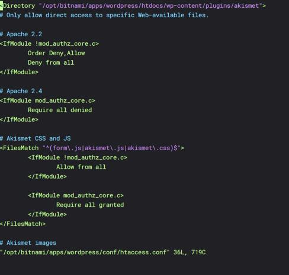
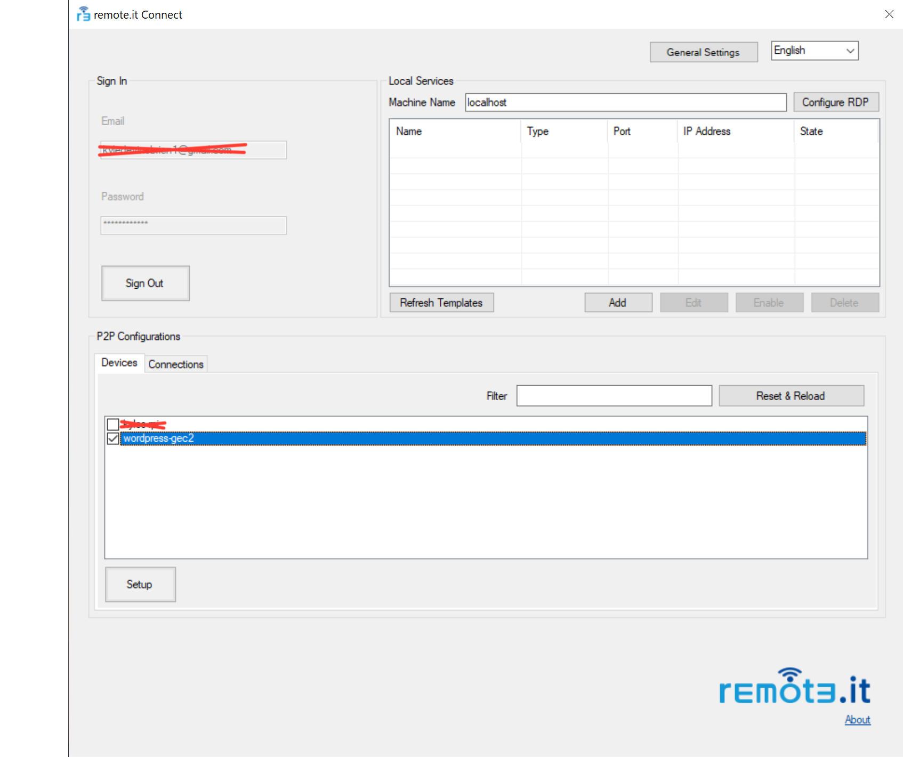
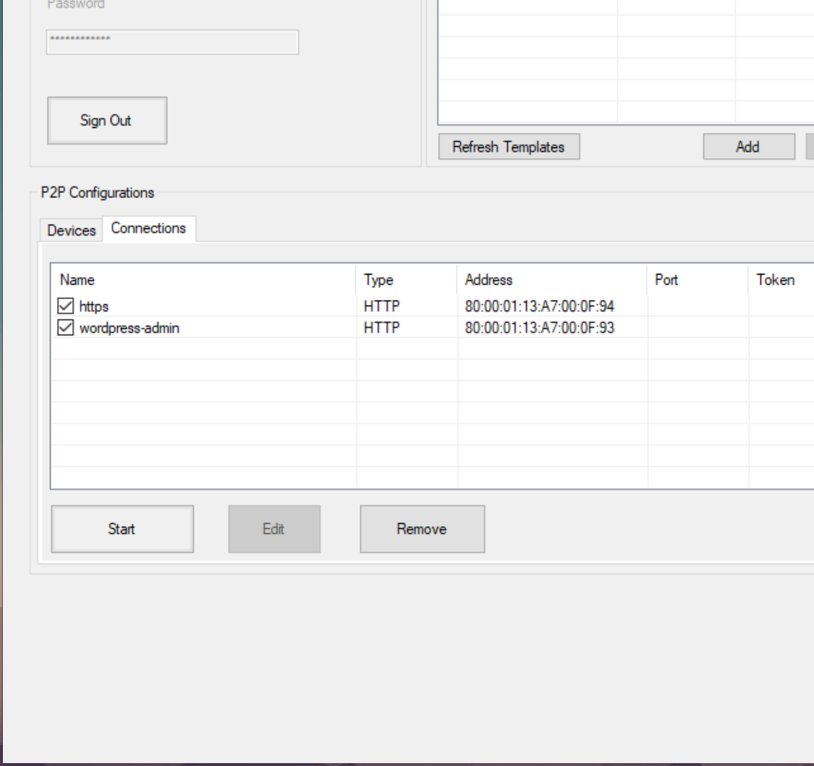
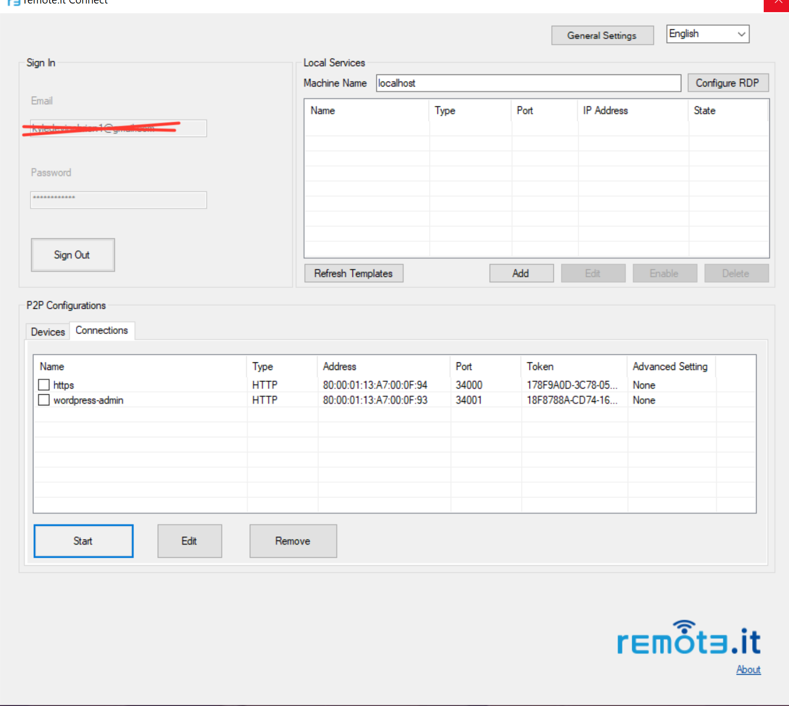
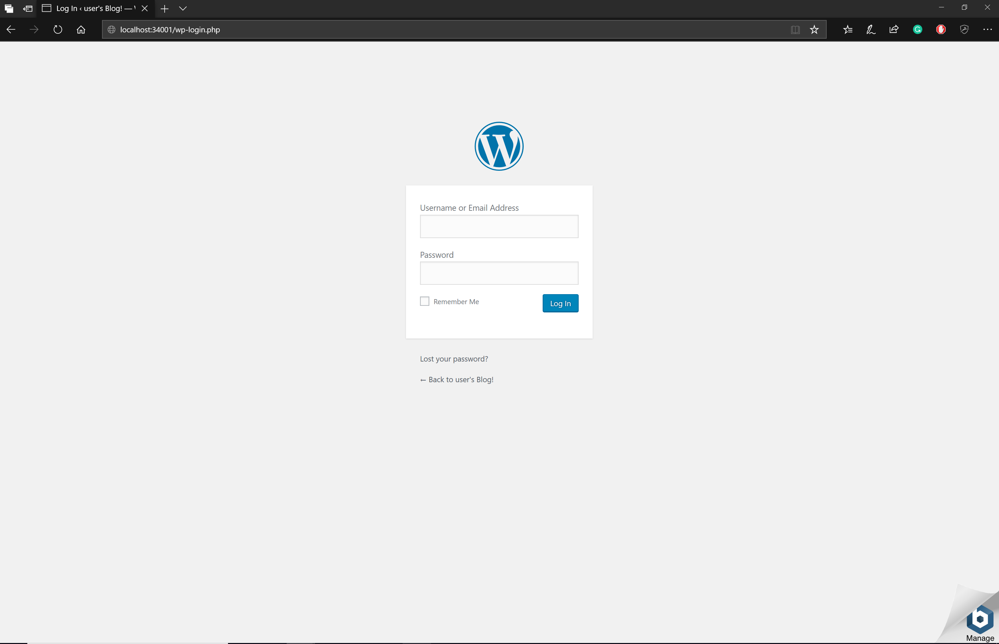

# Securing a WordPress Admin Dashboard on AWS EC2

### Overview

Wordpress powers approximately [32% of the top one million websites on the internet](https://www.codeinwp.com/blog/wordpress-statistics/). Despite its widespread adoption, there exist many widely known security variabilities.

A [common attack vector](https://www.inmotionhosting.com/support/edu/wordpress/wp-login-brute-force-attack) for WordPress websites is attackers gaining access to the WordPress admin dashboard \(/wp-admin\). Admins can use Apache Htaccess rules to block access to /wp-admin from all senders excluding localhost. While providing increased security, admins themselves will then have a difficult time accessing the admin dashboard.

Fortunately, we can use remote.it to access the WordPress admin dashboard while it's blocked to the outside world. In this guide, we'll deploy a WordPress configured AWS EC2 instance, lockdown /wp-admin using Htaccess, and create a proxy connection to the dashboard using remote.it.

### Prerequisites

1. A remote.it account. [Don't have one?](https://app.remote.it/auth/#/sign-up)
2. An AWS account with EC2 privileges.

### Launch your AWS EC2 Instance

We'll be using an AWS EC2 instance to deploy our WordPress site. Specifically, we'll be using the [BitNami WordPress EC2 AMI](https://aws.amazon.com/marketplace/pp/B00NN8Y43U). This AMI automates the installation and configuration of WordPress.

If you're new to EC2, follow this [AWS guide on how to configure and launch your instance](https://aws.amazon.com/getting-started/tutorials/launch-a-wordpress-website/). Make sure to select/generate an ssh key pair.

Enter the public IP address for your instance into your browser's search bar


The page that appears will look something like this


Notice how if you add `/admin` to your route you can access the admin login page. This is the security issue we're going to fix. We want to block all public access to this page but still be able to access it via remote.it.

### Lockdown wp-admin using htaccess.conf

#### SSH into your instance

We're going to use the key pair associated with your instance to connect via ssh. Run the following commands in your terminal.

```text
chmod 400 PATH_TO_KEY
ssh -i PATH_TO_KEY ubuntu@INSTANCE_ADDRES
```


You've now SSHed into the EC2 instance! Now we can start securing the WordPress site.

### Lockdown wp-admin using Htaccess

#### What is Htacces?

Htaccess is a directory level configuration file that, among other use cases, can be used to block access to particular resources. In the BitNami WordPress AMI, there is a single Htaccess file that handles configuration for the entire application. This is the file we'll be working with. To learn more about the BitNami WordPress AMI project structure, [check out the documentation](https://docs.bitnami.com/aws/apps/wordpress/).

#### Edit The Htacces Configuration File

Run the following command to begin editing the website Htaccess configuration.

`vim /opt/bitnami/apps/wordpress/conf/htaccess.con`



Add the following code to the bottom of the file.

```text
<Directory "/opt/bitnami/apps/wordpress/htdocs/wp-admin">
    # Block access to wp-admin to all IP's excluding localhost.
    Order deny,allow
    Deny from all
    Allow from 127.0.0.1
</Directory
```


### Optional: Locking down wp-login

If you wish to lock down wp-login as well, add the additional following block to the htaccess.conf file.

```text
<Directory "/opt/bitnami/apps/wordpress/htdocs/">
    <Files "wp-login.php">
        # Block access to wp-login to all IP's excluding localhost.
        Order deny,allow
        Deny from all
        Allow from 127.0.0.1
    </Files>
</Directory>
```

Save and exit Vim and run the following command to restart the web server.

`sudo /opt/bitnami/ctlscript.sh restart`

Once the server has restarted, `Site_IP/admin` will appear like this


Congratulations - you've now blocked all incoming access to your websites admin portal. This dramatically increases the security of your site. However, we currently have no way ourselves to access the admin dashboard. This is where remote.it comes in.

### Install remote.it connectd

Copy and paste the following command to your console \(be sure to copy both wget and the long URL after it\) to download the remote.it connectd package:

```text
wget https://github.com/remoteit/installer/releases/download/v2.2.3.24/connectd_2.2.3.24_amd64.deb
```

This package is compatible with 64-bit x86 Debian \(which includes Ubuntu, Linux Mint, and many other distributions\) and is compatible with the BitNami WordPress AMI.

Run the following command:

```text
sudo dpkg -i connectd_2.2.3.24_amd64.deb
```

Now, you're ready to run the interactive installer.

### Configure Your Device

1. Start the connectd installer by running `sudo connectd_installer` and sign in
2. Enter 1 for `Attach/reinstall a remote.it Service to an application`.
3. Chose the default port assignment \(80\).
4. Name the service `wordpress-admin`


You've now configured a remote.it service on the host machine. We will now be able to make secure HTTP proxy connection to our machine via remote.it.

### Generate a Connection

Using remote.it you can either generate temporary proxy connection using the remote.it web app, or generate a peer-to-peer connection. P2P connections have the advantage of being permanent as long as both daemons are running and allowing you to bookmark remote.it connections. Proxy connections require fewer steps to create but are temporary. 

### P2P Connections

### **Windows P2P**

Download the Windows Connectd Manager. Once installed, log in with your remote.it account and select your device. If you have a high number of devices on your account you'll have to search for your device by name. 



#### Generate The Proxy URL

Fill the check box next to your device name and click "Setup". This will take you to a list of your device's services.



Fill the check boxes next to the services you wish to establish connections with. Click "Start" once you've selected the desired services. 



Our P2P connections have now been generated. The local ports for each service can be found in the "ports" column. In this example, the P2P connection to the wordpress admin page is on localhost port 34001.

Go to **http://localhost:PORT** where **PORT** is the value in the Port column.



**Congratulations!** You've generated a P2P secure connection to your WordPress admin page. This link is accessible as long as connectd is running on both devices. 


### MacOS P2P

**Coming Soon**

\*\*\*\*

Continue this guide if you wish to generate temporary proxy connections using remote.it's cloud.

### Generate The Proxy Connection

Navigate to app.remote.it and select the device with the name you entered.


### Connect To The Admin Dashboard

Select the `wordpress-admin` http service. You will be presented with a proxy URL similar to `wcdnqety.p17.rt3.io`. Add `/wp-admin` to this path. This URL takes you to the WordPress admin dashboar


We've now just demonstrated the use for remote.it in securing your WordPress website. By using Htaccess, we've entirely blocked all public access to our admin dashboard making it inaccessible accept via remote.it. You can share your device with any other truster admins allowing your whole team to quickly and securely maintain your website.

  


